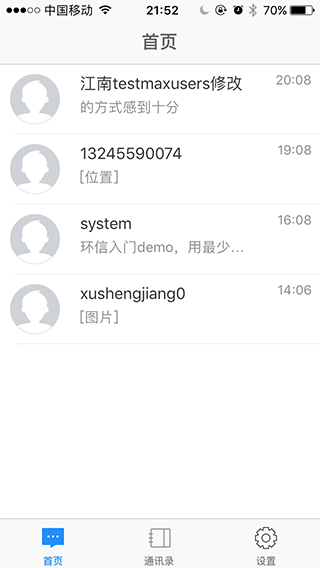
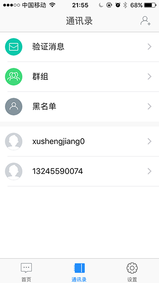

uchat
=======
### 1.项目介绍  
基于环信的聊天框架  
### 2.安装使用  
下载后进入项目目录，使用cocoapods安装，cocoapods安装方法大家自行学习安装。 
执行命令 `pod install`  
安装成功后会多出`Podfile.lock` `Pods` `UChat.xcworkspace`三个文件及目录。 
运行新的工程文件`UChat.xcworkspace`而不是原来的。 
### 3.屏幕截图  

### 说明
代码很乱也没有规划跟重构，代码也是有bug的，拿出来给大家一个参考学习交流。图标也是从网上摘的，如果有侵权请联系xusj10@163.com QQ:924334036

